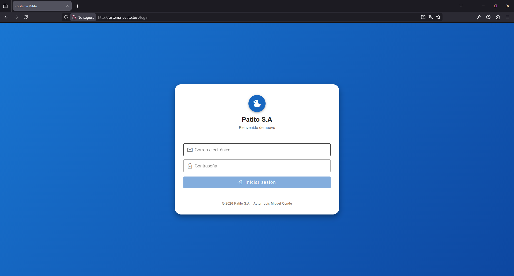
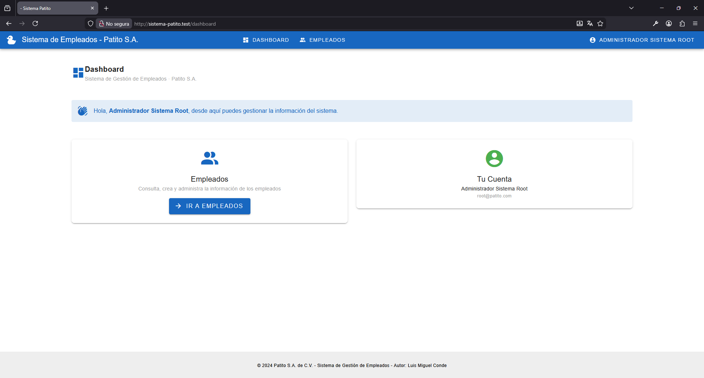
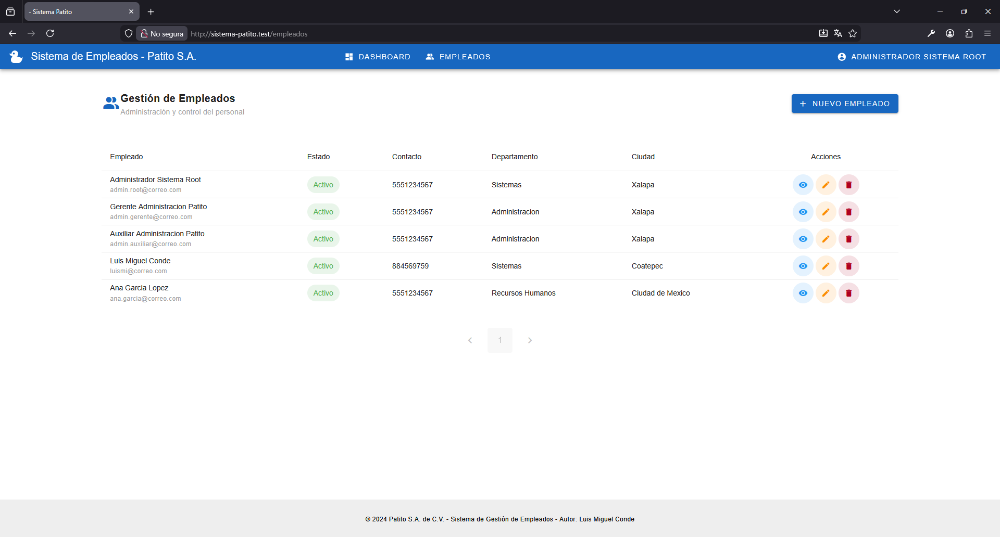
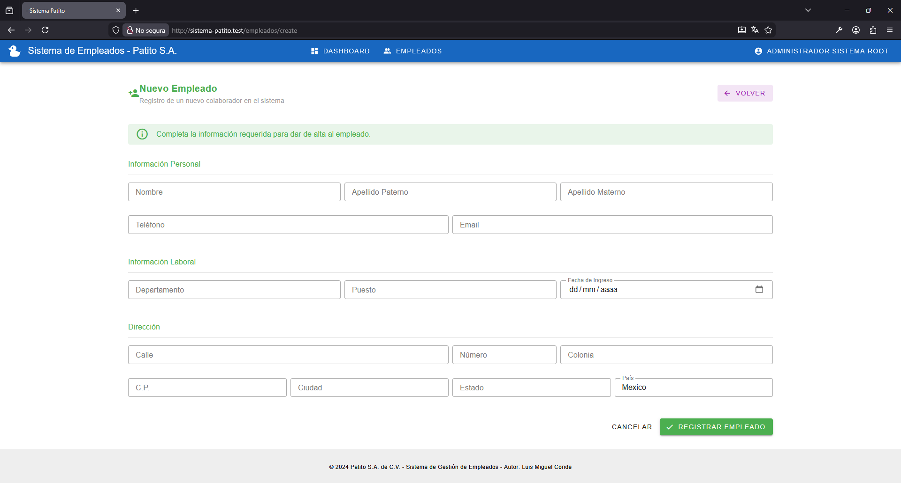
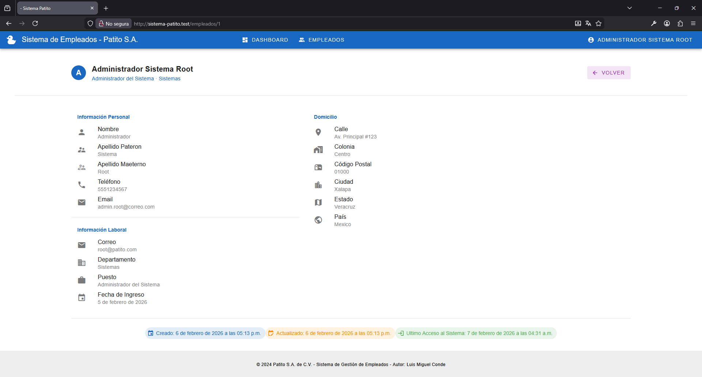
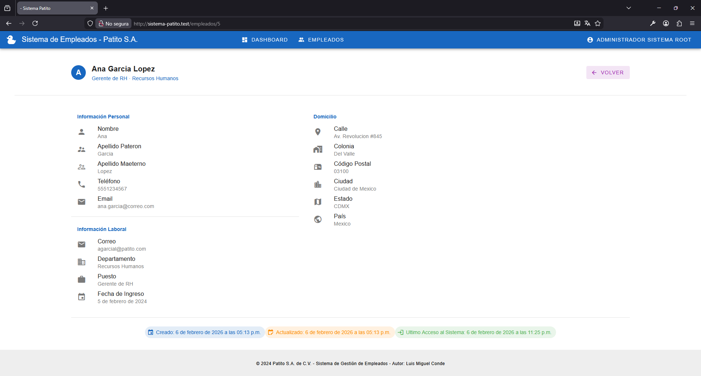
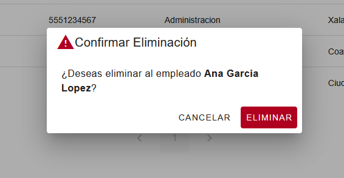
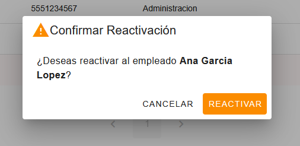

# Proceso de Reclutamiento – Prueba Técnica

**Autor:** Luis Miguel Conde

**Empresa:** Sistema Patito S.A. de C.V.

---

## 🛠️ Tecnologías


---

## 📄 Descripción del Proyecto

Sistema web para la **gestión de empleados** desarrollado para **Patito S.A. de C.V.**, empresa con más de 10 años de operación y múltiples sucursales en todo el país.

El sistema permite administrar la información del personal de forma centralizada, segura y eficiente, con control de accesos según el tipo de usuario.

---

## ✨ Características Principales

### 🔐 Autenticación (Login)

Existen **dos tipos de usuarios**:

#### 👑 Administradores

* Cuentas de prueba:

  * `root@patito.com`
  * `gerente@patito.com`
  * `auxiliar@patito.com`
* Contraseña: `password`

#### 👤 Usuarios Normales

* Se crean desde el sistema
* Contraseña por defecto: `patito123`

> ⚠️ **Nota:** Si un empleado está marcado como *inactivo*, no podrá acceder al sistema.



---

### 📊 Dashboard (Inicio)

Vista general del sistema con acceso a las principales funcionalidades.



---

### 👥 Gestión de Empleados

Listado general de empleados con opciones según el rol del usuario.



---

### ➕ Crear Empleado

* Disponible **solo para usuarios administradores**.



---

### 🔍 Visualizar Información Completa

* Todos los usuarios pueden consultar la información detallada de los empleados.



---

### ✏️ Modificar Empleado

* Disponible **solo para usuarios administradores**.



---

### 🗑️ Eliminar Empleado (Eliminación Lógica)

* Disponible **solo para usuarios administradores**.
* Se implementa una **eliminación lógica** utilizando el campo `status`, evitando borrar registros físicamente de la base de datos.



---

### ♻️ Reactivar Empleado

* Permite reactivar empleados previamente desactivados.
* Disponible **solo para usuarios administradores**.



---

## ⚙️ Instalación y Configuración

### 📋 Prerrequisitos

* PHP **8.4.16** o superior
* Composer **2.9.3** o superior
* Node.js **24.13.0** o superior
* MariaDB **12.1.2.0** o superior

---

### 🗄️ Configuración de Base de Datos

#### Crear la base de datos

```bash
mysql -u root -p -e "CREATE DATABASE patito;"
```

#### Ejecutar migraciones

```bash
php artisan migrate
```

#### Ejecutar seeders (datos de prueba)

```bash
php artisan db:seed
```

---

## ✅ Notas Finales

Este proyecto fue desarrollado como parte de una **prueba técnica**, priorizando buenas prácticas y claridad en el código.
